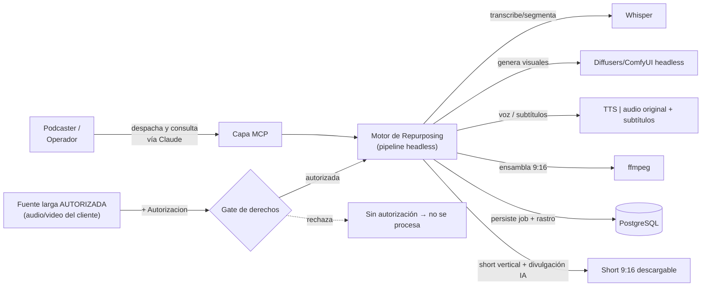
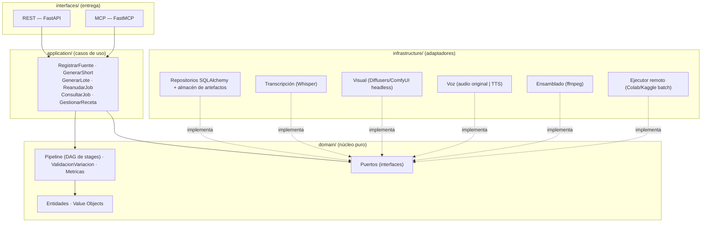
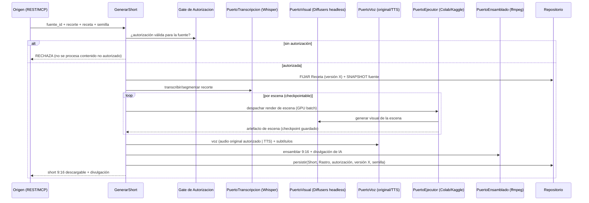
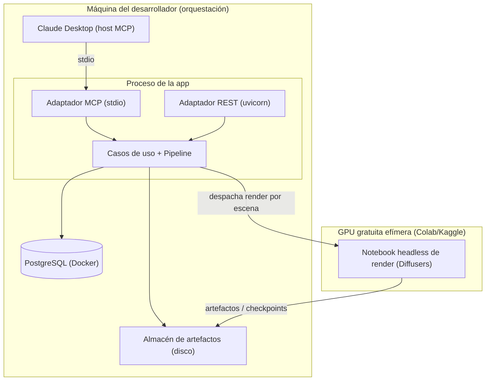

# SAD — Astilla · Motor de Repurposing de Contenido Largo a Shorts Verticales Animados + Capa MCP

> **Documento de Arquitectura de Software (Software Architecture Document)**
> Estructura: arc42 · Versión: 0.1 (draft) · Estado: propuesto para implementación
> Proyecto: **Astilla** (identificador técnico: `astilla`) · *(nombre tentativo — una astilla es un fragmento cortado de una pieza mayor, justo lo que es un clip; sin colisión detectada; confirmar dominio + INAPI clases 9/41/42)*
> Hub de contexto: ver [`CLAUDE.md`](./CLAUDE.md) y [`MEMORY.md`](./MEMORY.md)
> Origen: necesidad de mercado — los creadores de contenido largo (podcasts) no alcanzan a reciclar su material en formato vertical 9:16. Modelo de negocio objetivo: **agencia B2B de repurposing** (se produce para el creador, con su autorización; el creador publica en su propio canal). El modelo "subir contenido de terceros y monetizar" queda **fuera de alcance por riesgo legal y de plataforma** (ver §3.3).
> Ecosistema: **motor de orquestación de la vertical de medios** del autor. Reusa el *scaffolding* y el molde de documentación de Veredicto (Clean Architecture, FastMCP, docs vivas).

---

## Tabla de contenido

1. [Introducción y objetivos](#1-introducción-y-objetivos)
2. [Restricciones](#2-restricciones)
3. [Contexto y alcance](#3-contexto-y-alcance)
4. [Estrategia de solución](#4-estrategia-de-solución)
5. [Vista de bloques de construcción](#5-vista-de-bloques-de-construcción)
6. [Vista de ejecución (runtime)](#6-vista-de-ejecución-runtime)
7. [Vista de despliegue](#7-vista-de-despliegue)
8. [Conceptos transversales](#8-conceptos-transversales)
9. [Decisiones de arquitectura (ADRs)](#9-decisiones-de-arquitectura-adrs)
10. [Requisitos de calidad](#10-requisitos-de-calidad)
11. [Riesgos y deuda técnica](#11-riesgos-y-deuda-técnica)
12. [Sistema de documentación viva](#12-sistema-de-documentación-viva)
13. [Hoja de ruta por fases](#13-hoja-de-ruta-por-fases)
14. [Glosario](#14-glosario)

---

## 1. Introducción y objetivos

### 1.1 Qué es esto

Un **motor de repurposing**: toma una **fuente larga autorizada** (un episodio de podcast que el cliente posee o licenció), selecciona un segmento (una anécdota), y produce un **short vertical 9:16 animado** — con voz, visuales generados, subtítulos y ensamblado — listo para publicar. Es la herramienta de producción de una **agencia B2B**: se fabrica para el creador, que publica en su propio canal.

Incluye una **capa MCP** para disparar y consultar trabajos en lenguaje natural ("generá 3 shorts de este episodio, estilo cómic, con subtítulos en español").

**El valor no es el contenido, es el motor.** Animar la anécdota de alguien no es el activo; el activo es un pipeline que convierte contenido largo en shorts verticales **barato, rápido y reproducible**, corriendo en GPU gratuita por lotes.

**Lo que define este proyecto, y lo que lo hace legal, es una sola regla dura:** el motor **solo procesa contenido con autorización explícita** (provisto por el cliente, licenciado, o de dominio público / original). El gate de derechos es la primera puerta del pipeline, no un disclaimer al final.

Tres capacidades núcleo:

- **Pipeline headless por lotes, resumible:** correr en entornos efímeros (Colab/Kaggle gratis) sin perder trabajo: checkpoint por escena, idempotente, reanudable.
- **Stages intercambiables detrás de puertos:** transcripción, segmentación, generación visual, voz, subtítulos y ensamblado — cada uno con implementación local (modelo) o API, conmutables.
- **Variación material por diseño:** evitar la mismidad de plantilla que las plataformas desmonetizan; cada short debe diferenciarse, no ser un molde repetido.

### 1.2 Objetivos de calidad principales

| Prioridad | Atributo | Por qué es crítico aquí |
|-----------|----------|--------------------------|
| 1 | **Cumplimiento de derechos / consentimiento** | El motor NO debe procesar contenido sin autorización. Es el atributo que hace legal al producto; gobierna el resto. |
| 2 | **Resiliencia a entornos efímeros** | La GPU gratuita se desconecta; el pipeline debe checkpointear y reanudar sin rehacer todo. Diferenciador propio de este proyecto. |
| 3 | **Reproducibilidad / Determinismo** | Misma fuente + receta + semilla → mismo short (re-render, auditoría, control de calidad). |
| 4 | **Variación material / no-"inauthentic"** | Las plataformas desmonetizan contenido en masa y templado; el output debe variar materialmente. Requisito de producto, no solo estético. |
| 5 | **Costo ~0 honesto** | Free tiers de GPU/API; pero contabilizando el costo real en tiempo (reinstalación, descargas, desconexiones). |

> **Nota de diseño (criterio senior):** el error tentador es "instalar la UI web de ComfyUI en Colab y darle". Las plataformas restringieron correr esas UIs web en el tier gratuito, y además una UI interactiva muere con la desconexión. El enfoque maduro es **headless por lotes**: un pipeline que recibe (fuente autorizada + receta) y devuelve un video, con checkpoint por escena. Es lo que sobrevive en GPU efímera *y* es mejor ingeniería. El segundo error es construir el motor "agnóstico a derechos"; aquí los derechos son una **precondición de ejecución**, no una opción.

### 1.3 Stakeholders

| Rol | Interés en la arquitectura |
|-----|----------------------------|
| Podcaster / creador (cliente B2B) | Recibir shorts verticales llamativos de SU contenido para SU canal; resolver el reciclaje que no alcanza a hacer. |
| Operador / editor (usa el motor) | Producir lotes de shorts rápido y reproducible, sin babysittear sesiones. |
| Plataformas (YouTube/TikTok) | (Restricción, no usuario) políticas de contenido original/auténtico y de derechos. |
| Legal / derechos | Que el motor SOLO procese contenido autorizado; trazabilidad de la autorización. |
| Ingeniería | Pipeline como DAG de stages, puertos intercambiables, resiliencia, testabilidad. |
| Autor (portafolio) | Demostrar orquestación de pipelines de ML/medios, diseño para entornos efímeros, criterio legal, IA/MCP. |

---

## 2. Restricciones

### 2.1 Técnicas

- **Lenguaje:** Python 3.12+ (orquestación; ecosistema de medios y ML maduro).
- **Stages:** **Whisper / faster-whisper** (transcripción y subtítulos); **Diffusers / ComfyUI headless** para visuales (no la UI web); **TTS** (XTTS/Coqui local o API) cuando no se usa el audio original autorizado; **ffmpeg** para ensamblado y formato 9:16.
- **Tipado y validación:** Pydantic v2 en `application/`/`infrastructure/`/`interfaces/`. **`domain/` stdlib-only** (proyecto, escena, receta y autorización son puros).
- **Web framework:** FastAPI. **MCP:** FastMCP (stdio local; HTTP + OAuth 2.1 remoto).
- **Persistencia:** SQLAlchemy 2.0 + PostgreSQL; artefactos (audio/imágenes/clips) en almacenamiento de objetos / disco; outputs descargables.
- **Ejecución pesada:** GPU gratuita **headless por lotes** (Colab/Kaggle); orquestación local que despacha y recupera artefactos.
- **Inyección de dependencias:** `injector`. **Contenedores:** Docker. **Toolchain:** uv · ruff · mypy --strict · import-linter.

### 2.2 Organizativas / de proceso

- **Presupuesto bajo:** versión portafolio en ~USD 0 (local + free tiers de GPU/API). **Costo real reconocido:** reinstalación y descarga de modelos por sesión, sesiones efímeras, posibles desconexiones.
- **Metodología:** Specification-Driven Development.
- **Continuidad de contexto entre sesiones de IA** mediante documentación viva (§12).

### 2.3 Convenciones

- Idioma del dominio en **español** (Proyecto, Fuente, Recorte, Escena, Receta, Autorizacion, Short); técnico en inglés cuando es idiomático (9:16, render, stage, checkpoint).
- **Determinismo explícito:** fuente as-ingested, receta, modelos, prompts y semilla se registran por short. Librerías y modelos versionados para reproducibilidad en el mismo entorno.
- **Precondición dura:** ningún trabajo se ejecuta sin una `Autorizacion` válida asociada a la fuente.

---

## 3. Contexto y alcance

### 3.1 Contexto de negocio



### 3.2 Alcance funcional (qué SÍ hace)

- Registrar una **Fuente** con su **Autorizacion** (cliente/licencia/dominio público/original) — sin ella no se procesa.
- Transcribir y segmentar la fuente (Whisper) para identificar/recibir el recorte (anécdota).
- Generar **visuales animados** (Diffusers/ComfyUI headless) por escena, con checkpoint.
- Resolver la **voz**: usar el **audio original autorizado** del clip, o TTS cuando corresponda.
- Generar **subtítulos** sincronizados (Whisper) y **ensamblar** el short vertical 9:16 (ffmpeg).
- Garantizar **variación material** entre shorts (recetas/estilos diferenciados) y **divulgación de contenido sintético**.
- Versionar la **Receta** (estilo, formato, parámetros) y persistir un **snapshot** de la fuente as-ingested.
- Despachar y consultar trabajos por lotes —reanudables— vía MCP.

### 3.3 Fuera de alcance (explícito)

- **No republica ni monetiza contenido de terceros** por cuenta propia (el "modelo creador" sobre material ajeno). Riesgo legal (copyright) y de plataforma (contenido reutilizado/inauténtico). **No-objetivo declarado.**
- No es un canal ni una estrategia de monetización; eso es negocio, no software.
- **No clona voces de forma engañosa ni hace deepfakes**; si se sintetiza voz/imagen, se divulga.
- No decide la legalidad del contenido; **provee el gate de autorización**, la decisión jurídica es humana.
- No publica automáticamente en las plataformas en el MVP (entrega el archivo; publicar es del cliente).

---

## 4. Estrategia de solución

| Objetivo de calidad | Enfoque arquitectónico |
|---------------------|------------------------|
| Cumplimiento de derechos | **Gate de `Autorizacion`** como precondición de ejecución de todo job. (ADR-009) |
| Resiliencia efímera | Pipeline como **DAG de stages idempotentes con checkpoint** por escena; reanudable. (ADR-002) |
| Stages intercambiables | Cada stage (transcripción/visual/voz/subtítulo/ensamblado) detrás de un puerto; local o API. (ADR-003) |
| Determinismo | Receta + semilla + modelos versionados registrados por short. (ADR-006) |
| Variación material | Recetas diferenciadas y validación anti-mismidad; requisito de producto. (ADR-004) |
| Reproducibilidad estable | La **Receta versionada** + snapshot de fuente; el motor es estable. (ADR-008) |
| Auditabilidad | **Snapshot** de fuente as-ingested + rastro de stages + autorización. (ADR-005) |
| Divulgación | Contenido sintético marcado/divulgado en la salida. (ADR-010) |

> Idea fuerza (heredada de Veredicto): **el pipeline puro y los casos de uso bien hechos hacen la capa MCP casi gratis.** El valor difícil está en (1) el gate de derechos que hace legal el producto, y (2) la resiliencia en GPU efímera que lo hace viable a ~USD 0.

---

## 5. Vista de bloques de construcción

### 5.1 Nivel 1 — Capas (Clean Architecture)



> **Frontera dura:** el `domain/` define **qué es un proyecto, una escena, una receta y una autorización**, y **cómo se compone el pipeline** como estructuras puras, **sin Whisper, sin Diffusers, sin ffmpeg en las firmas de dominio**. Los **stages pesados viven en `infrastructure/`** detrás de puertos: el dominio define *qué* stages y en *qué orden* (el DAG) y *qué* es una autorización válida; la infraestructura provee *cómo* se transcribe, se genera y se ensambla. Esto hace cada stage intercambiable (modelo local ↔ API) y el orquestador testeable con stages falsos. Blindada con `import-linter`.

### 5.2 Nivel 2 — Módulos del dominio

```text
domain/
├── value_objects/
│   ├── timecode.py          # inicio/fin del recorte en la fuente
│   ├── formato.py           # 9:16, fps, resolución
│   ├── estilo.py            # estilo visual (cómic, realista, etc.)
│   ├── prompt.py            # prompt de generación por escena
│   └── semilla.py           # determinismo de generación
├── entities/
│   ├── fuente.py            # contenido largo as-ingested (+ hash)
│   ├── autorizacion.py      # PRECONDICIÓN: cliente | licencia | dominio_publico | original
│   ├── recorte.py           # segmento (anécdota) seleccionado de la fuente
│   ├── escena.py            # unidad de render (prompt + voz + duración)
│   ├── receta.py            # estilo + formato + parámetros (UNIDAD versionada)
│   ├── job.py               # ejecución: estado por stage, checkpoints
│   ├── short.py             # salida 9:16 (artefacto inmutable)
│   └── rastro.py            # RastroJob: stages, modelos, autorización, divulgación
├── services/
│   ├── pipeline.py          # DAG de stages: orden, dependencias, reanudación (puro)
│   ├── validacion_variacion.py # anti-mismidad entre shorts (no-"inauthentic")
│   └── metricas.py          # duración, costo, tiempo de render, reuso de checkpoints
└── ports/
    ├── repositorio_jobs.py
    ├── repositorio_recetas.py
    ├── puerto_transcripcion.py  # Whisper
    ├── puerto_visual.py         # Diffusers | ComfyUI headless | API
    ├── puerto_voz.py            # audio original | TTS
    ├── puerto_ensamblado.py     # ffmpeg
    └── puerto_ejecutor.py       # local | Colab/Kaggle batch
```

#### La autorización es una precondición, no un dato

A diferencia de los otros motores, aquí la entidad central de control es la **`Autorizacion`**: ningún caso de uso de generación se ejecuta sin una autorización válida ligada a la fuente. Es el equivalente "duro" del disclaimer:

```text
Autorizacion  (PRECONDICIÓN de ejecución)
├── id / fuente_id
├── tipo: CLIENTE | LICENCIA | DOMINIO_PUBLICO | ORIGINAL
├── titular / evidencia (referencia, no contenido legal)
├── alcance: usos permitidos (publicación por el cliente, etc.)
└── vigencia
# Sin Autorizacion válida → GenerarShort/GenerarLote NO se ejecutan.
```

### 5.3 Capa MCP — herramientas expuestas

| Herramienta MCP | Caso de uso que envuelve | Modo |
|-----------------|--------------------------|------|
| `registrar_fuente(fuente, autorizacion)` | RegistrarFuente | escritura (gated) |
| `generar_short(fuente_id, recorte, receta_id)` | GenerarShort | despacho (gated por autorización) |
| `generar_lote(fuente_id, recortes[], receta_id)` | GenerarLote | despacho (gated) |
| `consultar_job(job_id)` | ConsultarJob (estado por stage) | lectura |
| `reanudar_job(job_id)` | ReanudarJob (tras desconexión) | despacho |

> **Decisión de seguridad:** las herramientas que generan **están gateadas por `Autorizacion`**; si falta, fallan con un mensaje claro. La capa MCP no salta el gate de derechos. El contenido sintético se divulga en la salida.

---

## 6. Vista de ejecución (runtime)

### 6.1 Generación de un short (con gate de derechos)



Tres pasos críticos: **el gate de autorización** (propio de este dominio), **fijar la receta + snapshot** (reproducibilidad), y **el checkpoint por escena** (sobrevivir a desconexiones de la GPU gratuita, ADR-002).

### 6.2 Reanudación tras desconexión

Si la sesión efímera cae a mitad de un lote, `ReanudarJob` retoma desde el último checkpoint de escena: no se regeneran las escenas ya rendereadas. Es la diferencia entre "gratis y usable" y "gratis y desesperante".

---

## 7. Vista de despliegue

### 7.1 Fase local + GPU efímera (portafolio, ~USD 0)



> La orquestación, el gate de derechos y la persistencia viven local; **solo el render pesado se despacha a la GPU efímera, headless y por lotes**. Los artefactos se recuperan a disco local; los checkpoints permiten reanudar. Costo ~USD 0 con el costo real (tiempo de setup/descarga) contabilizado.

---

## 8. Conceptos transversales

- **Derechos primero:** ninguna ejecución sin `Autorizacion` válida; la trazabilidad de la autorización acompaña cada short. Es la columna legal del producto.
- **Divulgación de contenido sintético:** todo material generado por IA se marca/divulga en la salida (alineado con políticas de plataforma y con NO FAKES).
- **Variación material:** validación anti-mismidad entre shorts; el producto debe diferenciarse, no ser plantilla repetida.
- **Linaje de medios:** trazabilidad desde la fuente autorizada hasta el short final, stage por stage.
- **Honestidad de costo:** el "$0" se reporta con su costo real en tiempo (reinstalación, descargas, desconexiones).

---

## 9. Decisiones de arquitectura (ADRs)

**ADR-002 — Pipeline headless por lotes, idempotente y resumible.** *Contexto:* la GPU gratuita es efímera y la UI web está restringida en el tier gratis. *Consecuencia:* checkpoint por escena, reanudación; sobrevive desconexiones y es mejor ingeniería.

**ADR-003 — Stages detrás de puertos (local o API).** *Consecuencia:* transcripción/visual/voz/ensamblado intercambiables; se puede cambiar modelo gratuito por API estable sin tocar el orquestador.

**ADR-004 — Variación material como requisito de producto.** *Contexto:* las plataformas desmonetizan contenido en masa/templado. *Consecuencia:* validación anti-mismidad; recetas diferenciadas.

**ADR-005 — Snapshot de fuente + rastro por job.** *Consecuencia:* short reproducible y auditable; autorización trazable.

**ADR-006 — Pipeline determinista (receta/semilla/modelos explícitos).** *Consecuencia:* re-render idéntico; control de calidad.

**ADR-008 — Receta versionada; motor estable.** *Consecuencia:* fijar (receta, fuente, semilla) reproduce el short.

**ADR-009 — Gate de `Autorizacion` como precondición de ejecución.** *Contexto:* procesar contenido de terceros sin permiso es infracción y desmonetización. *Consecuencia:* sin autorización válida, no se ejecuta. **Es el ADR que hace legal el producto y gobierna el resto.**

**ADR-010 — Divulgación de contenido sintético.** *Consecuencia:* cumplimiento de plataforma; transparencia con la audiencia; sin deepfakes engañosos.

---

## 10. Requisitos de calidad

| Atributo | Escenario | Métrica objetivo |
|----------|-----------|------------------|
| Derechos | job sin autorización válida | rechazado antes de cualquier render |
| Resiliencia | desconexión a mitad de lote | reanuda sin regenerar escenas hechas |
| Reproducibilidad | (receta, fuente, semilla) repetida | short idéntico en el mismo entorno |
| Variación | lote de N shorts | diferencias materiales verificables entre ellos |
| Costo | render de un short en GPU gratuita | ~USD 0, con tiempo de setup reportado |

---

## 11. Riesgos y deuda técnica

| Riesgo | Impacto | Mitigación |
|--------|---------|------------|
| Procesar contenido de terceros sin permiso | **Alto (legal)** | Gate de `Autorizacion` obligatorio; B2C-republicación como no-objetivo (ADR-009) |
| Desmonetización por contenido inauténtico/reutilizado | Alto | Modelo B2B (publica el cliente) + variación material (ADR-004) |
| Deepfake / clonación de voz engañosa | Alto | Divulgación de IA; no clonar voces sin consentimiento (ADR-010) |
| Desconexión de GPU efímera | Medio | Checkpoint por escena + reanudación (ADR-002) |
| Restricción de UIs web en Colab gratis | Medio | Headless por lotes, no UI web (ADR-002) |
| Costo de reinstalación/descarga por sesión | Medio | Cachear modelos donde se pueda; contabilizar el tiempo honestamente |
| Calidad/consistencia visual entre escenas | Medio | Receta + semilla + control de estilo; revisión humana |

**Deuda aceptada en el MVP:** sin nube propia, sin auth MCP (local), render en free tier (con su fricción), sin publicación automática a plataformas, consistencia de personajes limitada. Documentado como fase posterior.

---

## 11.b Revisión de halcón (crítica de diseño)

> Auditoría crítica del propio SAD antes de implementar. El objetivo es exponer dónde el documento invierte rigor en lo que ya sabe resolver y subestima lo que decide si el producto sirve. Cada punto trae una acción concreta y un cambio de prioridad.

### H-1 · La coherencia visual está mal calificada como riesgo "Medio" — es el riesgo de producto #1

Generar visuales con difusión **escena por escena no produce coherencia de personaje ni de mundo** entre escenas, ni siquiera con semilla fija. Es la diferencia entre un short vendible y un collage incoherente que el cliente rechaza. Hoy vive como *deuda aceptada* ("consistencia de personajes limitada"), pero si no alcanza un umbral, **la propuesta de valor "animado" se cae entera**.

- **Acción:** convertir la coherencia visual en **criterio de aceptación de la Fase 2**, con estrategia explícita (IP-Adapter / imagen de referencia de personaje / LoRA por cliente / o un estilo que *tolere* incoherencia, p. ej. cómic abstracto, recortes, collage).
- **Cambio de prioridad:** sube a objetivo de calidad de primer nivel (ver H-7).

### H-2 · La GPU efímera gratuita puede ser el cerro equivocado (restricción autoimpuesta)

"Resiliencia a entornos efímeros" es **objetivo de calidad #2**, pero ese atributo solo existe porque elegimos pelear contra Colab/Kaggle. Dos problemas reales:

1. **Despacho programático frágil:** no hay forma limpia y estable de que un orquestador local "despache render por escena" a Colab gratis; se termina en hacks (polling de Drive, túneles gradio). El `PuertoEjecutor` esconde esto en el diagrama.
2. **Economía real:** el cold start honesto (reinstalar/descargar modelos por sesión) es de 5–15 min. Para una **agencia B2B que factura al cliente**, ~USD 0.20–1 por short en GPU serverless (Replicate / Modal / fal.ai / Runpod) es ruido. Estamos optimizando una restricción de **portafolio** ($0) como si fuera de **producto**.

- **Acción:** **invertir el default del `PuertoEjecutor`** → serverless GPU API por defecto; Colab/Kaggle como adaptador experimental "$0". El puerto sigue siendo buen diseño; cambia cuál implementación es la principal.

### H-3 · Determinismo ⟂ GPU efímera: contradicción no declarada

"Misma fuente + receta + semilla → mismo short" con difusión **solo se cumple con los mismos pesos, versiones de librería y la misma GPU/CUDA/sampler**. En free tier no controlamos el hardware: otra GPU = otro resultado con la misma semilla. Los objetivos de calidad #2 (efímero) y #3 (determinismo) se pelean.

- **Acción:** bajar la promesa a **"reproducible dado el mismo adaptador y entorno fijado"** y declarar la tensión explícitamente en §10.

### H-4 · La selección del recorte es la inteligencia real del producto, y está en una línea

"Transcribir y segmentar… para **identificar/recibir** el recorte" esconde la decisión más importante: ¿el operador elige el clip o el motor encuentra el momento vendible en 2 h de podcast? Auto-seleccionar el mejor fragmento de 30–90 s es el problema sobre el que se construyeron Opus Clip / Vizard.

- **Acción:** declarar **operator-driven en el MVP** (el operador da `timecode`), y modelar la auto-selección como servicio de dominio + fase propia si se persigue como diferenciador.

### H-5 · Falta el gate de revisión humana / QC antes de entregar

El pipeline está modelado *fire-and-forget*: render → ensambla → entrega. Con calidad generativa actual, el flujo real de agencia es **generar candidatos → un humano cura/aprueba → entrega**. El determinismo da reproducibilidad, **no calidad**.

- **Acción:** añadir estado `Short.EN_REVISION` y un loop de **regeneración por escena** (aprobar / rechazar / re-render con otra semilla) antes de marcar el short como entregable.

### H-6 · TTS sobra en el MVP y agranda la superficie de riesgo

Si la fuente es un podcast, **la voz original autorizada ES el activo y el gancho**. El TTS sintético resta autenticidad, empeora la posición frente a plataformas y abre toda la superficie de "clonación de voz / deepfake" que el propio doc lista como riesgo Alto. El producto nítido es: **audio original + visuales generados (capa sintética) + subtítulos**.

- **Acción:** sacar TTS del MVP; dejar `puerto_voz` con una sola implementación (audio original) y TTS como puerto futuro.

### H-7 · Ceremonia de arquitectura vs. riqueza real del dominio

En el fondo esto es un **pipeline ETL/render + un gate de derechos**. El gate de `Autorizacion` es dominio genuino y rico; el resto (8 entidades, value objects, `injector`, `import-linter`, 4 capas) corre el riesgo de ser *arquitectura para demostrar arquitectura*. No hay que quitarla, hay que **vigilar que el peso del diseño esté en el gate de derechos y en la coherencia visual, no en pulir puertos para un CRUD de recetas**.

### H-8 · "Variación material" está asertada, no especificada

`validacion_variacion.py` promete "diferencias materiales verificables" pero **no define métrica ni umbral**, y el detector real de "inauténtico" de las plataformas es una caja negra móvil que no se puede testear.

- **Acción:** o se define una métrica concreta (distancia de *perceptual hash* / embeddings entre shorts de un lote, con umbral) o se baja a **"recetas diferenciadas por diseño"** sin pretensión de validación automática.

### Reordenamiento propuesto de objetivos de calidad (§1.2)

| # | Antes | Después (propuesto) |
|---|-------|---------------------|
| 1 | Cumplimiento de derechos | **Cumplimiento de derechos** (se mantiene) |
| 2 | Resiliencia a entornos efímeros | **Coherencia visual / calidad entregable** (H-1, H-5) |
| 3 | Reproducibilidad / determinismo | Reproducibilidad *dado entorno fijado* (H-3) |
| 4 | Variación material | Variación material *especificada* (H-8) |
| 5 | Costo ~0 honesto | Costo honesto → serverless por defecto (H-2) |
| — | — | Resiliencia efímera: degradada a propiedad de un **adaptador opcional** |

### Slice real para la primera demo (lo que construimos ahora)

Pipeline mínimo **que produce un video 9:16 real**, respetando las fronteras: **gate de derechos → transcripción (Whisper) → recorte (operator-driven) → subtítulos → visual (fondo determinista, puerto intercambiable) → ensamblado ffmpeg + divulgación de IA → Short + Rastro**. El stage visual arranca con un fondo generado determinista (honesto, $0, sin GPU) y queda **detrás del puerto** para sustituirlo por Diffusers/serverless sin tocar el orquestador. Ver `pipeline/` y `docs/CASES.md`.

---

## 12. Sistema de documentación viva

Idéntico a Veredicto: `CLAUDE.md` (hub), `MEMORY.md` (bitácora), `docs/AUDIT.md` (auditoría por fase con *Vista de halcón*), `docs/TROUBLESHOOTING.md`, `docs/CASES.md`, `docs/DERECHOS.md` (registro del modelo de autorización y divulgación), `README.md`, `DEPLOY.md`, y este `SAD.md` como fuente de verdad.

> **Ventaja de ecosistema:** Astilla **hereda el scaffolding de Veredicto** (capas, toolchain, plantillas de docs, FastMCP). El esfuerzo nuevo se concentra en el orquestador del pipeline, el gate de derechos y los adaptadores de stages (Whisper/Diffusers/ffmpeg/ejecutor remoto).

---

## 13. Hoja de ruta por fases

Cada fase termina con auditoría en `AUDIT.md` y sign-off.

| Fase | Entregable | Demostrable |
|------|-----------|-------------|
| **0 — Scaffolding** | Capas, docs (§12), esqueleto de dominio, Docker + Postgres (reusa molde de Veredicto) | Repo navegable, fronteras blindadas |
| **1 — Pipeline núcleo headless** | Ingesta + **gate de Autorizacion**; transcripción (Whisper); ensamblado básico 9:16 con subtítulos (ffmpeg); checkpoint/reanudación | "De un audio autorizado saco un short vertical con subtítulos, y si se corta, reanuda" |
| **2 — Generación visual** | Stage visual (Diffusers/ComfyUI headless) detrás del puerto, despachado a GPU gratuita por escena; receta de estilo | "Genero las escenas animadas en la nube gratis, escena por escena" |
| **3 — Voz + variación material** | Voz (audio original autorizado o TTS) + divulgación de IA; validación anti-mismidad entre shorts | "Produzco un lote de shorts diferenciados, no clones de plantilla" |
| **4 — Capa MCP** | Servidor MCP (stdio): despacho y consulta de jobs, gateado por autorización; Claude Desktop como host | "Le pido a Claude 3 shorts de este episodio en estilo cómic y consulto el avance" |
| **5 — Opcional** | Dashboard de jobs, plantillas por cliente, multi-idioma, publicación asistida, MCP remoto + OAuth | Herramienta de agencia completa sin reescribir |

> **Recomendación de alcance:** fases 1–4 son el portafolio. El activo demostrable es **el motor**, no un canal. Profundo y angosto: un pipeline reproducible, legal y resiliente vale más que mil videos subidos a un canal que te pueden desmonetizar.

---

## 14. Glosario

| Término | Definición |
|---------|------------|
| **Repurposing** | Reconvertir contenido largo en piezas cortas (aquí, verticales 9:16). |
| **9:16 / vertical** | Formato de short para TikTok/Reels/Shorts. |
| **Fuente** | Contenido largo autorizado de entrada (episodio de podcast). |
| **Autorizacion** | Precondición de ejecución: derecho a procesar la fuente (cliente/licencia/dominio público/original). |
| **Recorte** | Segmento (anécdota) seleccionado de la fuente. |
| **Escena** | Unidad de render (prompt + voz + duración); el checkpoint es por escena. |
| **Receta** | Estilo + formato + parámetros, versionada e inmutable. Unidad atómica de reproducción. |
| **Job** | Ejecución del pipeline con estado por stage y checkpoints. |
| **Headless** | Sin interfaz gráfica; el pipeline corre como script/lote (clave en GPU efímera). |
| **Whisper** | Modelo de voz→texto (transcripción y subtítulos). |
| **TTS** | Texto→voz (síntesis), cuando no se usa el audio original. |
| **Diffusers / ComfyUI** | Generación de imágenes/clips con modelos de difusión. |
| **Contenido inauténtico / reutilizado** | Categorías que las plataformas desmonetizan; se evitan con B2B + variación material. |
| **Divulgación de contenido sintético** | Marcar/avisar que el material fue generado por IA. |
| **MCP** | Model Context Protocol. |

---

*Fin del SAD. Mantener sincronizado con `CLAUDE.md` ante cualquier cambio de arquitectura. Nota legal: el motor solo procesa contenido autorizado; el modelo de "subir contenido de terceros y monetizar" queda fuera de alcance.*
